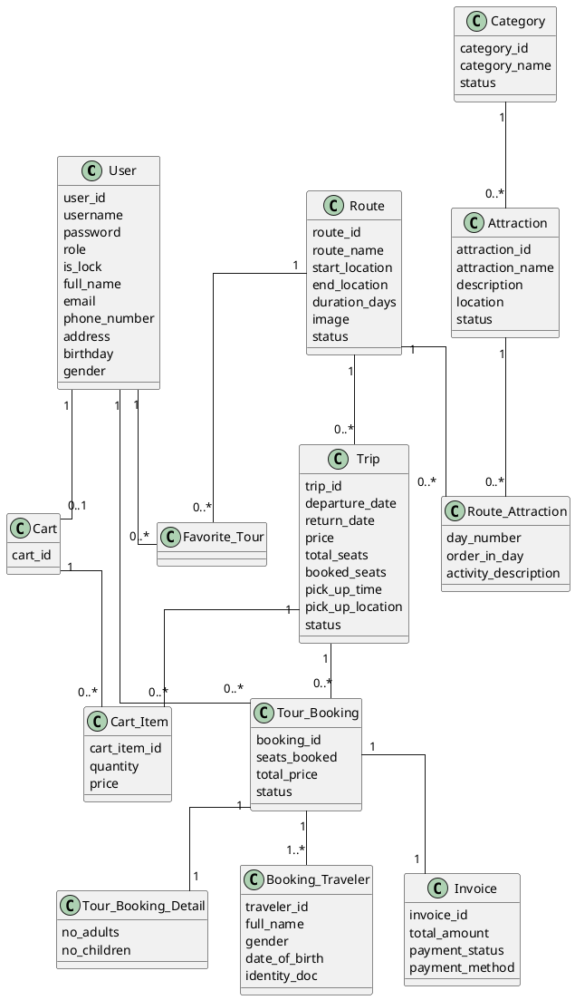

# Domain Diagram - Tourist Management System

<!-- diagram id="brd-domain-diagram" -->

```plantuml
@startuml
skinparam roundcorner 5
skinparam linetype ortho

' Core Entities
class User {
  user_id
  username
  password
  role
  is_lock
  full_name
  email
  phone_number
  address
  birthday
  gender
}

class Category {
  category_id
  category_name
  status
}

class Attraction {
  attraction_id
  attraction_name
  description
  location
  status
}

class Route {
  route_id
  route_name
  start_location
  end_location
  duration_days
  image
  status
}

class Route_Attraction {
  day_number
  order_in_day
  activity_description
}

class Trip {
  trip_id
  departure_date
  return_date
  price
  total_seats
  booked_seats
  pick_up_time
  pick_up_location
  status
}

class Cart {
  cart_id
}

class Cart_Item {
  cart_item_id
  quantity
  price
}

class Favorite_Tour {
}

class Tour_Booking {
  booking_id
  seats_booked
  total_price
  status
}

class Tour_Booking_Detail {
  no_adults
  no_children
}

class Booking_Traveler {
  traveler_id
  full_name
  gender
  date_of_birth
  identity_doc
}

class Invoice {
  invoice_id
  total_amount
  payment_status
  payment_method
}

' Relationships
User "1" -- "0..1" Cart
User "1" -- "0..*" Tour_Booking
User "1" -- "0..*" Favorite_Tour

Category "1" -- "0..*" Attraction
Route "1" -- "0..*" Route_Attraction
Attraction "1" -- "0..*" Route_Attraction
Route "1" -- "0..*" Trip
Route "1" -- "0..*" Favorite_Tour

Cart "1" -- "0..*" Cart_Item
Trip "1" -- "0..*" Cart_Item

Trip "1" -- "0..*" Tour_Booking
Tour_Booking "1" -- "1" Tour_Booking_Detail
Tour_Booking "1" -- "1..*" Booking_Traveler
Tour_Booking "1" -- "1" Invoice

@enduml
```
