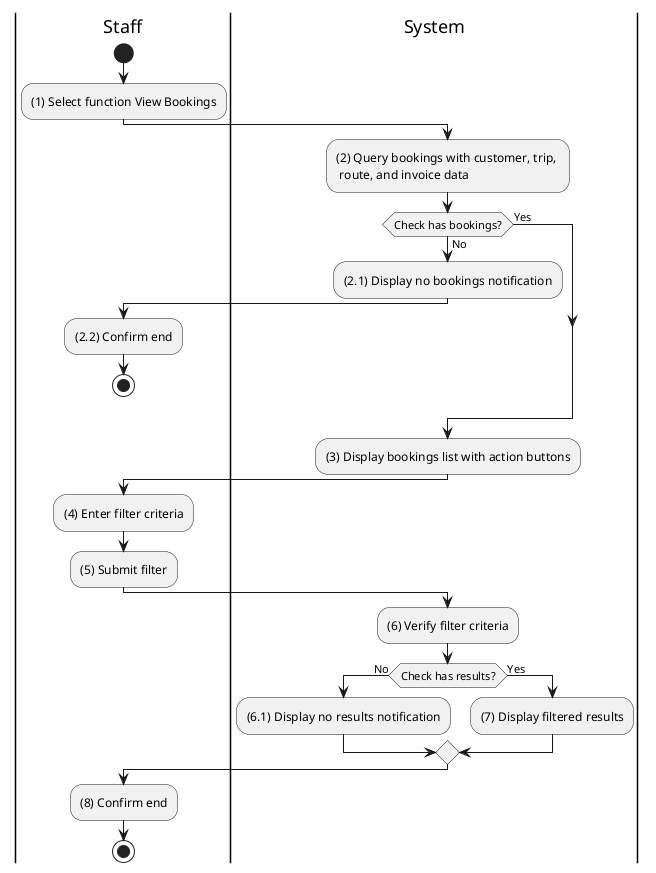

# Activity View and Filter Bookings

```plantuml
@startuml
|St|Staff
|S|System

|St|
start

:(1) Select function View Bookings;

|S|
:(2) Query bookings with customer, trip, \n route, and invoice data;

if (Check has bookings?) then (No)
  :(2.1) Display no bookings notification;
  |St|
  :(2.2) Confirm end;
  stop
else (Yes)
endif
|S|
:(3) Display bookings list with action buttons;


  |St|
  :(4) Enter filter criteria;
  :(5) Submit filter;

  |S|
  :(6) Verify filter criteria;

  if (Check has results?) then (No)
    :(6.1) Display no results notification;
    |St|
  else (Yes)
    |S|
    :(7) Display filtered results;
    |St|
  endif


:(8) Confirm end;

stop

@enduml
```

<!-- diagram id="activity-adjust-and-track-bookings-view-and-filter-bookings" -->
