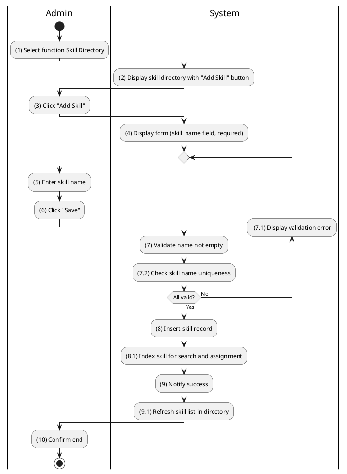

# Activity Add System Skill

```plantuml
@startuml

|A|Admin
|S|System

|A|
start
:(1) Select function Skill Directory;

|S|
:(2) Display skill directory with "Add Skill" button;

|A|
:(3) Click "Add Skill";

|S|
:(4) Display form (skill_name field, required);

repeat
  |A|
  :(5) Enter skill name;
  :(6) Click "Save";

  |S|
  :(7) Validate name not empty;
  :(7.2) Check skill name uniqueness;
  backward: (7.1) Display validation error;
repeat while (All valid?) is (No) not (Yes)

:(8) Insert skill record;
:(8.1) Index skill for search and assignment;
:(9) Notify success;
:(9.1) Refresh skill list in directory;

|A|
:(10) Confirm end;

stop
@enduml
```

<!-- diagram id="activity-admin-add-system-skill" -->
