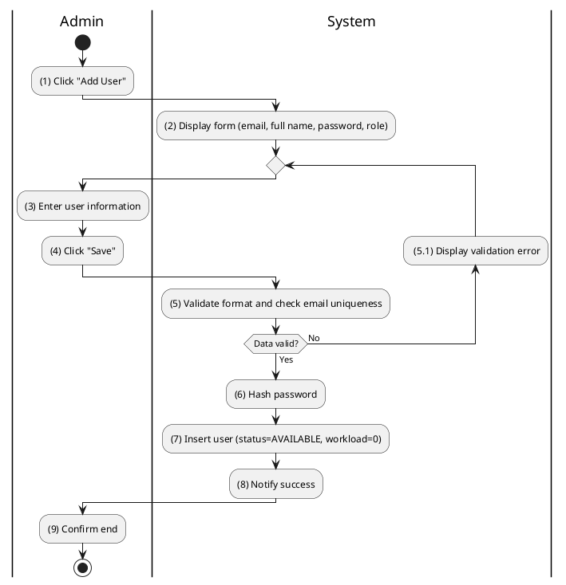

# Activity Add System User

```plantuml
@startuml
|A|Admin
|S|System

|A|
start
:(1) Click "Add User";

|S|
:(2) Display form (email, full name, password, role);

repeat
  |A|
  :(3) Enter user information;
  :(4) Click "Save";

  |S|
  :(5) Validate format and check email uniqueness;
  backward: (5.1) Display validation error;
repeat while (Data valid?) is (No) not (Yes)

:(6) Hash password;
:(7) Insert user (status=AVAILABLE, workload=0);
:(8) Notify success;

|A|
:(9) Confirm end;

stop
@enduml
```

<!-- diagram id="activity-admin-add-system-user" -->
