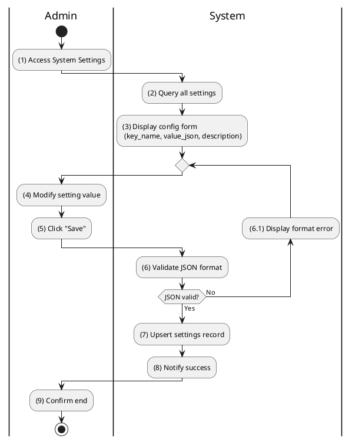

# Activity Configure System Parameters

```plantuml
@startuml
|A|Admin
|S|System

|A|
start
:(1) Access System Settings;

|S|
:(2) Query all settings;
:(3) Display config form \n (key_name, value_json, description);

repeat
  |A|
  :(4) Modify setting value;
  :(5) Click "Save";

  |S|
  :(6) Validate JSON format;
  backward: (6.1) Display format error;
repeat while (JSON valid?) is (No) not (Yes)

:(7) Upsert settings record;
:(8) Notify success;

|A|
:(9) Confirm end;

stop
@enduml
```

<!-- diagram id="activity-admin-configure-system-parameters" -->
