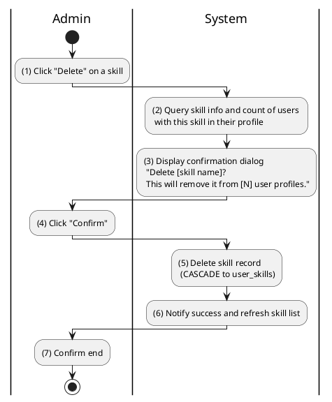

# Activity Delete System Skill

```plantuml
@startuml
|A|Admin
|S|System

|A|
start
:(1) Click "Delete" on a skill;

|S|
:(2) Query skill info and count of users \n with this skill in their profile;
:(3) Display confirmation dialog \n "Delete [skill name]? \n This will remove it from [N] user profiles.";

|A|
:(4) Click "Confirm";

|S|
:(5) Delete skill record \n (CASCADE to user_skills);
:(6) Notify success and refresh skill list;

|A|
:(7) Confirm end;

stop
@enduml
```

<!-- diagram id="activity-admin-delete-system-skill" -->
