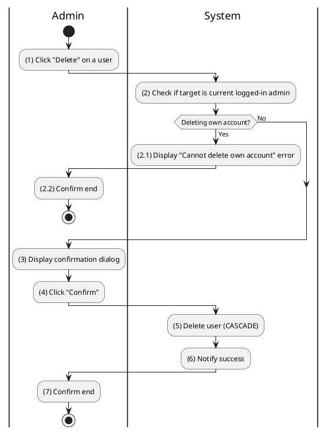

# Activity Delete System User

```plantuml
@startuml
|A|Admin
|S|System

|A|
start
:(1) Click "Delete" on a user;

|S|
:(2) Check if target is current logged-in admin;

if (Deleting own account?) then (Yes)
  :(2.1) Display "Cannot delete own account" error;
  |A|
  :(2.2) Confirm end;
  stop
else (No)
endif

:(3) Display confirmation dialog;

|A|
:(4) Click "Confirm";

|S|
:(5) Delete user (CASCADE);
:(6) Notify success;

|A|
:(7) Confirm end;

stop
@enduml
```

<!-- diagram id="activity-admin-delete-system-user" -->
