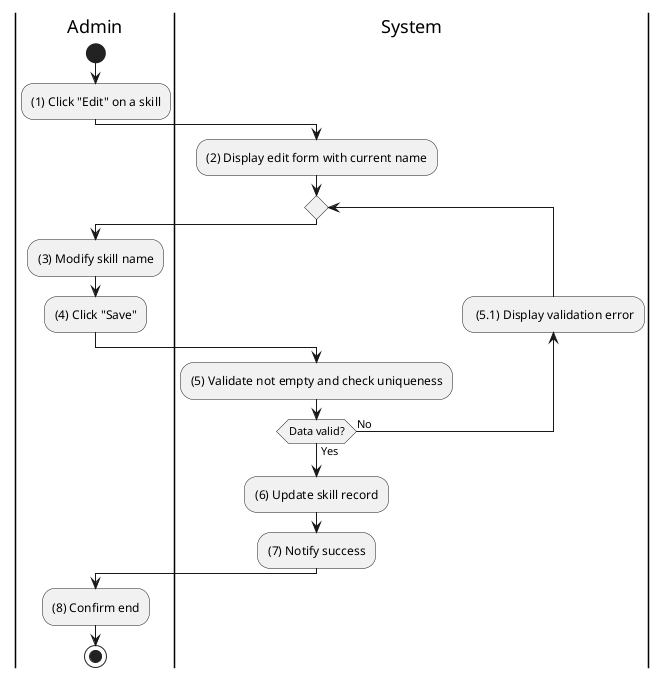

# Activity Edit System Skill

```plantuml
@startuml
|A|Admin
|S|System

|A|
start
:(1) Click "Edit" on a skill;

|S|
:(2) Display edit form with current name;

repeat
  |A|
  :(3) Modify skill name;
  :(4) Click "Save";

  |S|
  :(5) Validate not empty and check uniqueness;
  backward: (5.1) Display validation error;
repeat while (Data valid?) is (No) not (Yes)

:(6) Update skill record;
:(7) Notify success;

|A|
:(8) Confirm end;

stop
@enduml
```

<!-- diagram id="activity-admin-edit-system-skill" -->
