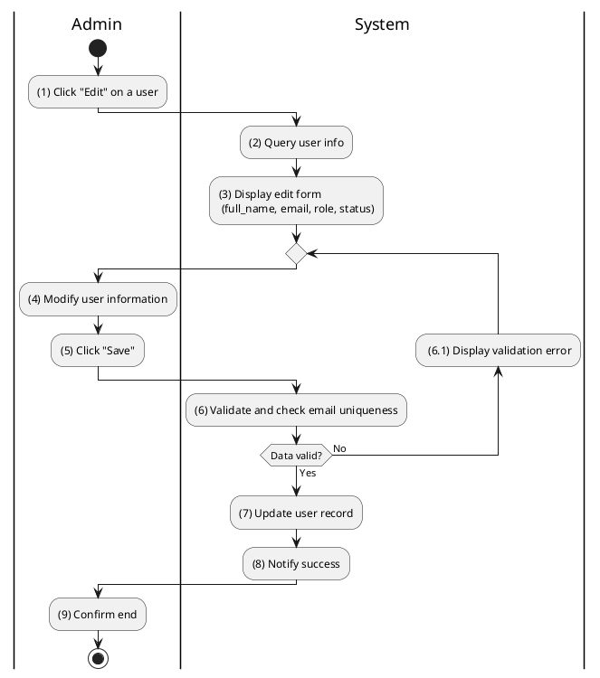

# Activity Edit System User

```plantuml
@startuml
|A|Admin
|S|System

|A|
start
:(1) Click "Edit" on a user;

|S|
:(2) Query user info;
:(3) Display edit form \n (full_name, email, role, status);

repeat
  |A|
  :(4) Modify user information;
  :(5) Click "Save";

  |S|
  :(6) Validate and check email uniqueness;
  backward: (6.1) Display validation error;
repeat while (Data valid?) is (No) not (Yes)

:(7) Update user record;
:(8) Notify success;

|A|
:(9) Confirm end;

stop
@enduml
```

<!-- diagram id="activity-admin-edit-system-user" -->
