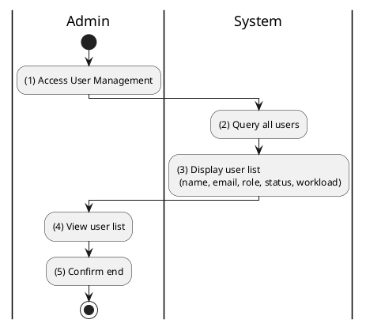

# Activity View Global User List

```plantuml
@startuml
|A|Admin
|S|System

|A|
start
:(1) Access User Management;

|S|
:(2) Query all users;
:(3) Display user list \n (name, email, role, status, workload);

|A|
:(4) View user list;
:(5) Confirm end;

stop
@enduml
```

<!-- diagram id="activity-admin-view-global-user-list" -->
