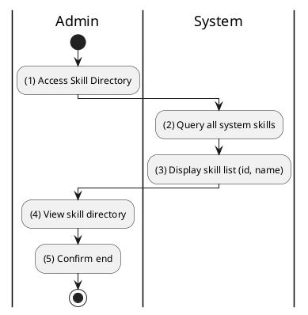

# Activity View System Skill Directory

```plantuml
@startuml
|A|Admin
|S|System

|A|
start
:(1) Access Skill Directory;

|S|
:(2) Query all system skills;
:(3) Display skill list (id, name);

|A|
:(4) View skill directory;
:(5) Confirm end;

stop
@enduml
```

<!-- diagram id="activity-admin-view-system-skill-directory" -->
