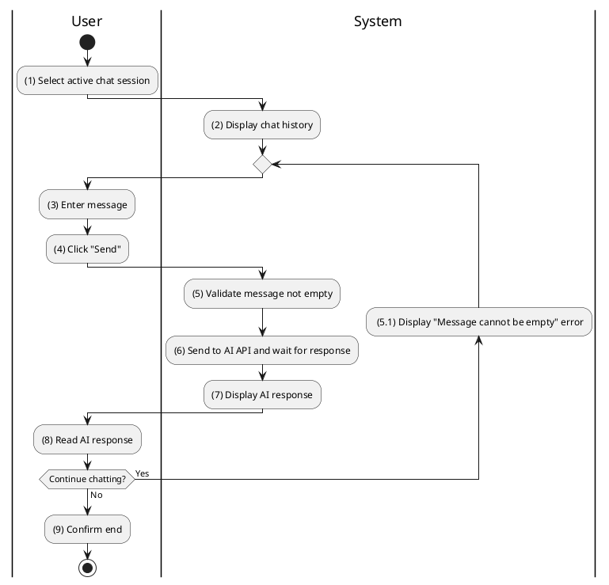

# Activity Chat with AI

```plantuml
@startuml
|U|User
|S|System

|U|
start
:(1) Select active chat session;

|S|
:(2) Display chat history;

repeat
  |U|
  :(3) Enter message;
  :(4) Click "Send";

  |S|
  :(5) Validate message not empty;
  backward: (5.1) Display "Message cannot be empty" error;
  :(6) Send to AI API and wait for response;
  :(7) Display AI response;
  |U|
  :(8) Read AI response;
repeat while (Continue chatting?) is (Yes) not (No)

:(9) Confirm end;

stop
@enduml
```

<!-- diagram id="activity-ai-assistant-chat-with-ai" -->
