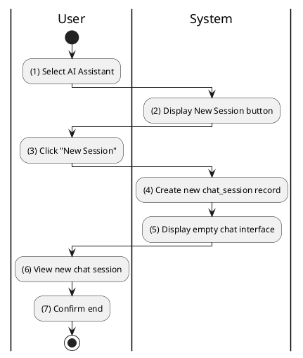

# Activity Create New AI Chat Session

```plantuml
@startuml
|U|User
|S|System

|U|
start
:(1) Select AI Assistant;

|S|
:(2) Display New Session button;

|U|
:(3) Click "New Session";

|S|
:(4) Create new chat_session record;
:(5) Display empty chat interface;

|U|
:(6) View new chat session;
:(7) Confirm end;

stop
@enduml
```

<!-- diagram id="activity-ai-assistant-create-new-ai-chat-session" -->
