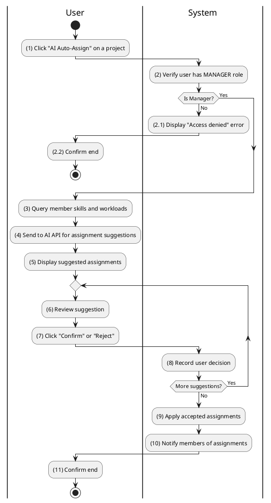

# Activity Request AI Auto-Assignment

```plantuml
@startuml
|U|User
|S|System

|U|
start
:(1) Click "AI Auto-Assign" on a project;

|S|
:(2) Verify user has MANAGER role;

if (Is Manager?) then (No)
  :(2.1) Display "Access denied" error;
  |U|
  :(2.2) Confirm end;
  stop
else (Yes)
endif

:(3) Query member skills and workloads;
:(4) Send to AI API for assignment suggestions;
:(5) Display suggested assignments;

repeat
  |U|
  :(6) Review suggestion;
  :(7) Click "Confirm" or "Reject";

  |S|
  :(8) Record user decision;
repeat while (More suggestions?) is (Yes) not (No)

:(9) Apply accepted assignments;
:(10) Notify members of assignments;

|U|
:(11) Confirm end;

stop
@enduml
```

<!-- diagram id="activity-ai-assistant-request-ai-auto-assignment" -->
