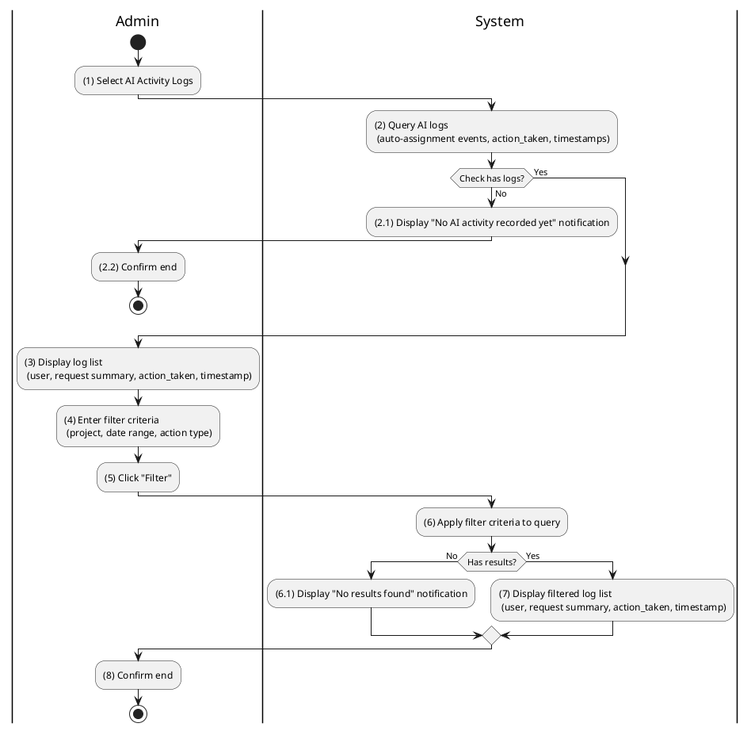

# Activity View AI Activity Logs

```plantuml
@startuml
|A|Admin
|S|System

|A|
start
:(1) Select AI Activity Logs;

|S|
:(2) Query AI logs \n (auto-assignment events, action_taken, timestamps);

if (Check has logs?) then (No)
  :(2.1) Display "No AI activity recorded yet" notification;
  |A|
  :(2.2) Confirm end;
  stop
else (Yes)
endif

:(3) Display log list \n (user, request summary, action_taken, timestamp);

|A|
:(4) Enter filter criteria \n (project, date range, action type);
:(5) Click "Filter";

|S|
:(6) Apply filter criteria to query;

if (Has results?) then (No)
  :(6.1) Display "No results found" notification;
  |A|
else (Yes)
  |S|
  :(7) Display filtered log list \n (user, request summary, action_taken, timestamp);
  |A|
endif

:(8) Confirm end;

stop
@enduml
```

<!-- diagram id="activity-ai-assistant-view-ai-activity-logs" -->
