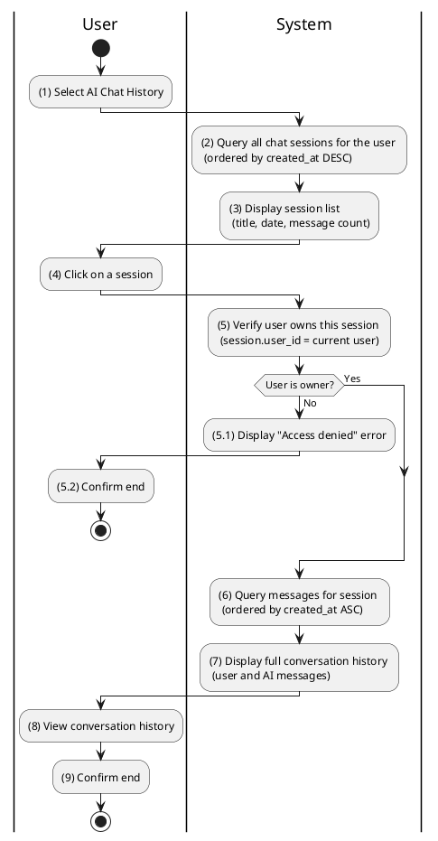

# Activity View AI Chat History

```plantuml
@startuml
|U|User
|S|System

|U|
start
:(1) Select AI Chat History;

|S|
:(2) Query all chat sessions for the user \n (ordered by created_at DESC);
:(3) Display session list \n (title, date, message count);

|U|
:(4) Click on a session;

|S|
:(5) Verify user owns this session \n (session.user_id = current user);

if (User is owner?) then (No)
  :(5.1) Display "Access denied" error;
  |U|
  :(5.2) Confirm end;
  stop
else (Yes)
endif

|S|
:(6) Query messages for session \n (ordered by created_at ASC);
:(7) Display full conversation history \n (user and AI messages);

|U|
:(8) View conversation history;
:(9) Confirm end;

stop
@enduml
```

<!-- diagram id="activity-ai-assistant-view-ai-chat-history" -->
