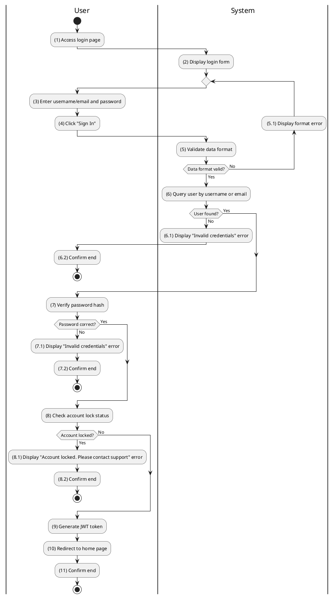

# Activity Login / Sign In

```plantuml
@startuml
|U|User
|S|System

|U|
start
:(1) Access login page;

|S|
:(2) Display login form;

repeat
  |U|
  :(3) Enter username/email and password;
  :(4) Click "Sign In";

  |S|
  :(5) Validate data format;
  backward: (5.1) Display format error;
repeat while (Data format valid?) is (No) not (Yes)

:(6) Query user by username or email;

if (User found?) then (No)
  :(6.1) Display "Invalid credentials" error;
  |U|
  :(6.2) Confirm end;
  stop
else (Yes)
endif

:(7) Verify password hash;

if (Password correct?) then (No)
  :(7.1) Display "Invalid credentials" error;
  |U|
  :(7.2) Confirm end;
  stop
else (Yes)
endif

:(8) Check account lock status;

if (Account locked?) then (Yes)
  :(8.1) Display "Account locked. Please contact support" error;
  |U|
  :(8.2) Confirm end;
  stop
else (No)
endif

:(9) Generate JWT token;
:(10) Redirect to home page;

|U|
:(11) Confirm end;

stop
@enduml
```

<!-- diagram id="activity-auth-login" -->
