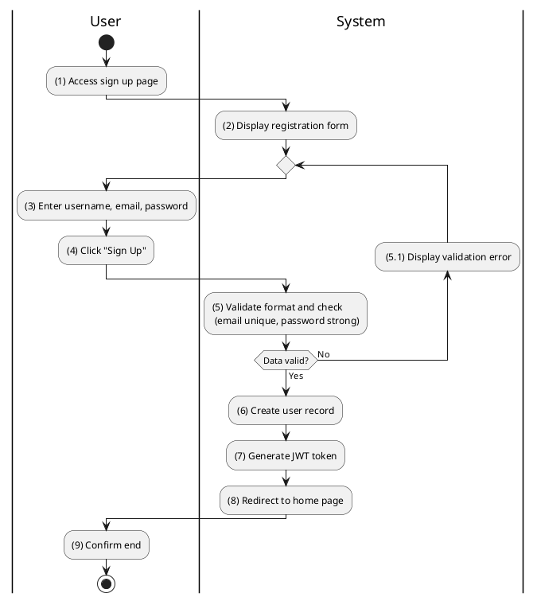

# Activity Register / Sign Up

```plantuml
@startuml
|U|User
|S|System

|U|
start
:(1) Access sign up page;

|S|
:(2) Display registration form;

repeat
  |U|
  :(3) Enter username, email, password;
  :(4) Click "Sign Up";

  |S|
  :(5) Validate format and check \n (email unique, password strong);
  backward: (5.1) Display validation error;
repeat while (Data valid?) is (No) not (Yes)

:(6) Create user record;
:(7) Generate JWT token;
:(8) Redirect to home page;

|U|
:(9) Confirm end;

stop
@enduml
```

<!-- diagram id="activity-auth-register" -->
