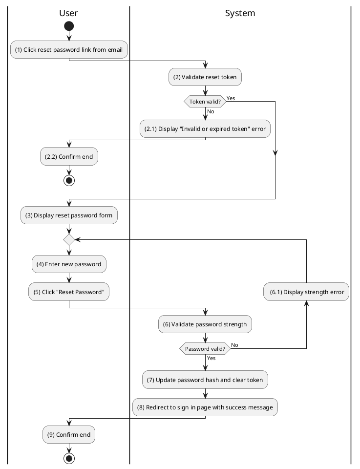

# Activity Reset Password

```plantuml
@startuml
|U|User
|S|System

|U|
start
:(1) Click reset password link from email;

|S|
:(2) Validate reset token;

if (Token valid?) then (No)
  :(2.1) Display "Invalid or expired token" error;
  |U|
  :(2.2) Confirm end;
  stop
else (Yes)
endif

:(3) Display reset password form;

repeat
  |U|
  :(4) Enter new password;
  :(5) Click "Reset Password";

  |S|
  :(6) Validate password strength;
  backward: (6.1) Display strength error;
repeat while (Password valid?) is (No) not (Yes)

:(7) Update password hash and clear token;
:(8) Redirect to sign in page with success message;

|U|
:(9) Confirm end;

stop
@enduml
```

<!-- diagram id="activity-auth-reset-password" -->
