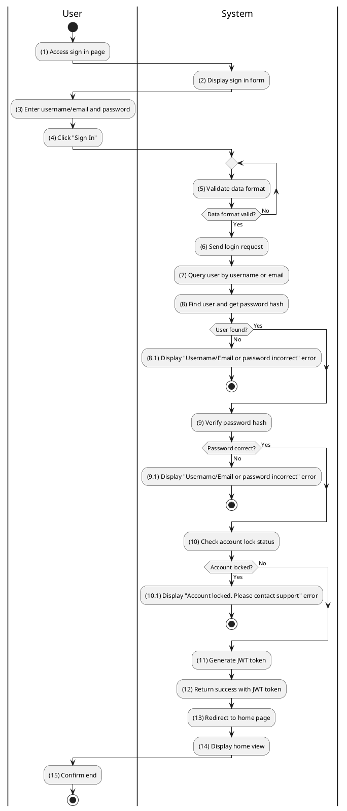

# Activity Sign In

```plantuml
@startuml
|U|User
|S|System

|U|
start
:(1) Access sign in page;

|S|
:(2) Display sign in form;

|U|
:(3) Enter username/email and password;
:(4) Click "Sign In";

|S|
repeat
  :(5) Validate data format;
repeat while (Data format valid?) is (No) not (Yes)

:(6) Send login request;
:(7) Query user by username or email;
:(8) Find user and get password hash;

if (User found?) then (No)
  :(8.1) Display "Username/Email or password incorrect" error;
  stop
else (Yes)
endif

:(9) Verify password hash;

if (Password correct?) then (No)
  :(9.1) Display "Username/Email or password incorrect" error;
  stop
else (Yes)
endif

:(10) Check account lock status;

if (Account locked?) then (Yes)
  :(10.1) Display "Account locked. Please contact support" error;
  stop
else (No)
endif

:(11) Generate JWT token;
:(12) Return success with JWT token;
:(13) Redirect to home page;
:(14) Display home view;

|U|
:(15) Confirm end;

stop
@enduml
```

<!-- diagram id="activity-auth-sign-in" -->
