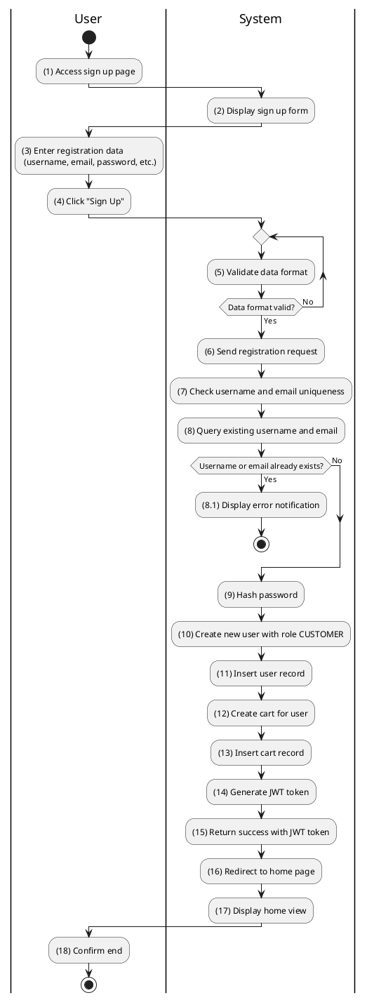

# Activity Sign Up

```plantuml
@startuml
|U|User
|S|System

|U|
start
:(1) Access sign up page;

|S|
:(2) Display sign up form;

|U|
:(3) Enter registration data \n (username, email, password, etc.);
:(4) Click "Sign Up";

|S|
repeat
  :(5) Validate data format;
repeat while (Data format valid?) is (No) not (Yes)

:(6) Send registration request;
:(7) Check username and email uniqueness;
:(8) Query existing username and email;

if (Username or email already exists?) then (Yes)
  :(8.1) Display error notification;
  stop
else (No)
endif

:(9) Hash password;
:(10) Create new user with role CUSTOMER;
:(11) Insert user record;
:(12) Create cart for user;
:(13) Insert cart record;
:(14) Generate JWT token;
:(15) Return success with JWT token;
:(16) Redirect to home page;
:(17) Display home view;

|U|
:(18) Confirm end;

stop
@enduml
```

<!-- diagram id="activity-auth-sign-up" -->
