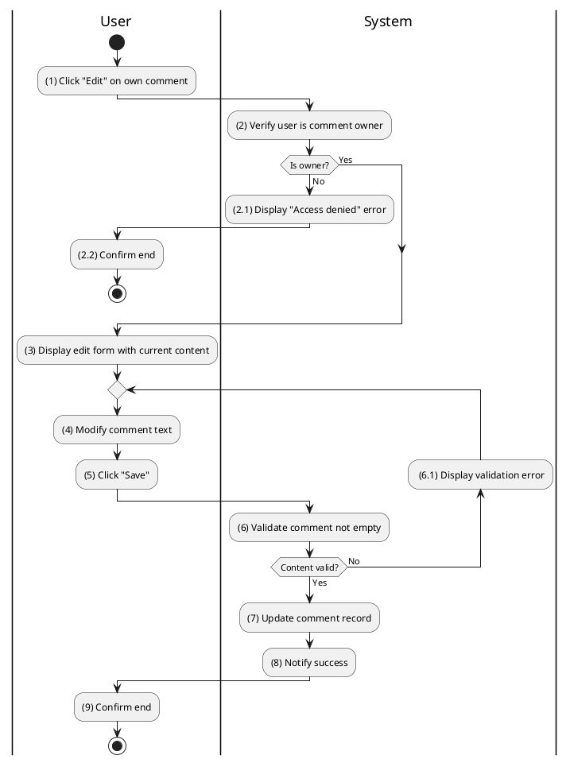

# Activity Edit Comment

```plantuml
@startuml
|U|User
|S|System

|U|
start
:(1) Click "Edit" on own comment;

|S|
:(2) Verify user is comment owner;

if (Is owner?) then (No)
  :(2.1) Display "Access denied" error;
  |U|
  :(2.2) Confirm end;
  stop
else (Yes)
endif

:(3) Display edit form with current content;

repeat
  |U|
  :(4) Modify comment text;
  :(5) Click "Save";

  |S|
  :(6) Validate comment not empty;
  backward: (6.1) Display validation error;
repeat while (Content valid?) is (No) not (Yes)

:(7) Update comment record;
:(8) Notify success;

|U|
:(9) Confirm end;

stop
@enduml
```

<!-- diagram id="activity-interaction-communication-edit-comment" -->
