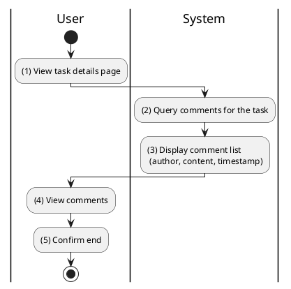

# Activity View Comments

```plantuml
@startuml
|U|User
|S|System

|U|
start
:(1) View task details page;

|S|
:(2) Query comments for the task;
:(3) Display comment list \n (author, content, timestamp);

|U|
:(4) View comments;
:(5) Confirm end;

stop
@enduml
```

<!-- diagram id="activity-interaction-communication-view-comments" -->
