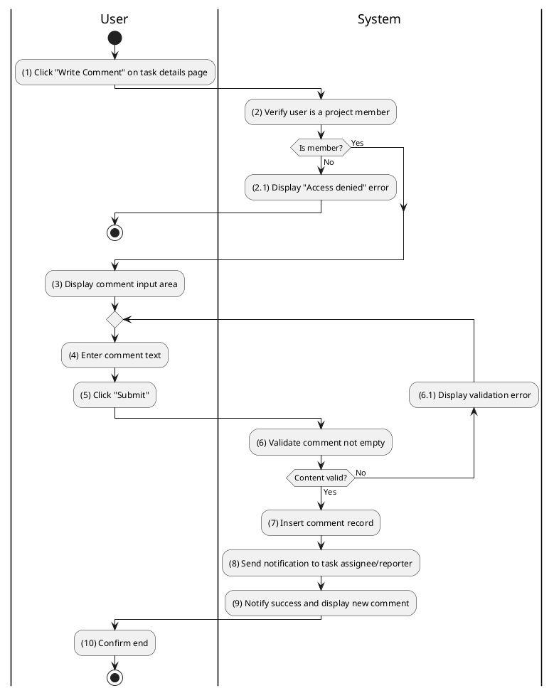

# Activity Write Comment

```plantuml
@startuml
|U|User
|S|System

|U|
start
:(1) Click "Write Comment" on task details page;

|S|
:(2) Verify user is a project member;

if (Is member?) then (No)
  :(2.1) Display "Access denied" error;
  |U|
  stop
else (Yes)
endif

:(3) Display comment input area;

repeat
  |U|
  :(4) Enter comment text;
  :(5) Click "Submit";

  |S|
  :(6) Validate comment not empty;
  backward: (6.1) Display validation error;
repeat while (Content valid?) is (No) not (Yes)

:(7) Insert comment record;
:(8) Send notification to task assignee/reporter;
:(9) Notify success and display new comment;

|U|
:(10) Confirm end;

stop
@enduml
```

<!-- diagram id="activity-interaction-communication-write-comment" -->
