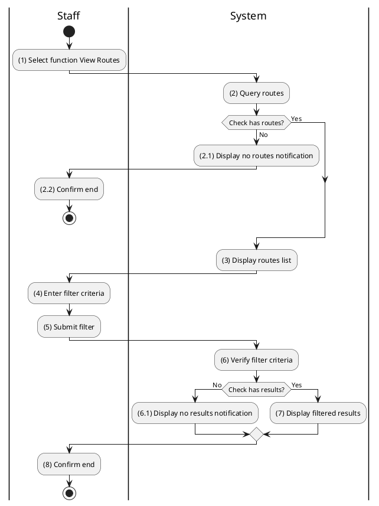

# Activity View and Filter Routes

```plantuml
@startuml
|S|Staff
|Sy|System

|S|
start

:(1) Select function View Routes;

|Sy|
:(2) Query routes;

if (Check has routes?) then (No)
  :(2.1) Display no routes notification;
  |S|
  :(2.2) Confirm end;
  stop
else (Yes)
endif
|Sy|
:(3) Display routes list;


  |S|
  :(4) Enter filter criteria;
  :(5) Submit filter;

  |Sy|
  :(6) Verify filter criteria;

  if (Check has results?) then (No)
    :(6.1) Display no results notification;
    |S|
  else (Yes)
    |Sy|
    :(7) Display filtered results;
    |S|
  endif


:(8) Confirm end;

stop

@enduml

<!-- diagram id="activity-manage-routes-view-and-filter-routes" -->
```
