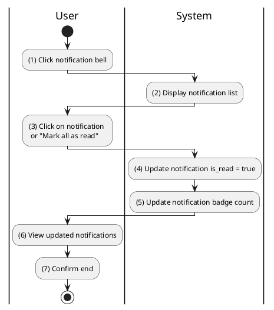

# Activity Mark Notification as Read

```plantuml
@startuml
|U|User
|S|System

|U|
start
:(1) Click notification bell;

|S|
:(2) Display notification list;

|U|
:(3) Click on notification \n or "Mark all as read";

|S|
:(4) Update notification is_read = true;
:(5) Update notification badge count;

|U|
:(6) View updated notifications;
:(7) Confirm end;

stop
@enduml
```

<!-- diagram id="activity-notification-management-mark-notification-as-read" -->
