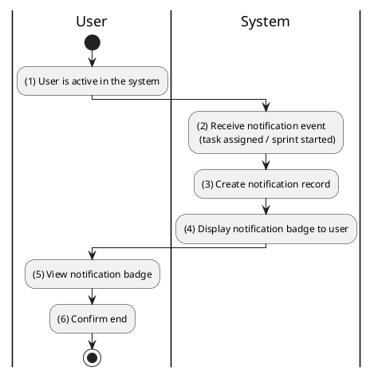

# Activity Receive Notification

```plantuml
@startuml
|U|User
|S|System

|U|
start
:(1) User is active in the system;

|S|
:(2) Receive notification event \n (task assigned / sprint started);
:(3) Create notification record;
:(4) Display notification badge to user;

|U|
:(5) View notification badge;
:(6) Confirm end;

stop
@enduml
```

<!-- diagram id="activity-notification-management-receive-notification" -->
