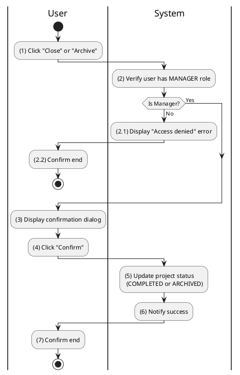

# Activity Close / Archive Project

```plantuml
@startuml
|U|User
|S|System

|U|
start
:(1) Click "Close" or "Archive";

|S|
:(2) Verify user has MANAGER role;

if (Is Manager?) then (No)
  :(2.1) Display "Access denied" error;
  |U|
  :(2.2) Confirm end;
  stop
else (Yes)
endif

:(3) Display confirmation dialog;

|U|
:(4) Click "Confirm";

|S|
:(5) Update project status \n (COMPLETED or ARCHIVED);
:(6) Notify success;

|U|
:(7) Confirm end;

stop
@enduml
```

<!-- diagram id="activity-project-management-close-archive-project" -->
