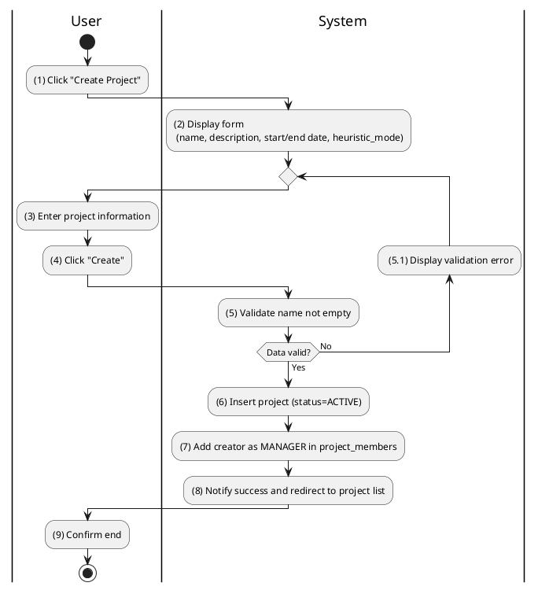

# Activity Create New Project

```plantuml
@startuml
|U|User
|S|System

|U|
start
:(1) Click "Create Project";

|S|
:(2) Display form \n (name, description, start/end date, heuristic_mode);

repeat
  |U|
  :(3) Enter project information;
  :(4) Click "Create";

  |S|
  :(5) Validate name not empty;
  backward: (5.1) Display validation error;
repeat while (Data valid?) is (No) not (Yes)

:(6) Insert project (status=ACTIVE);
:(7) Add creator as MANAGER in project_members;
:(8) Notify success and redirect to project list;

|U|
:(9) Confirm end;

stop
@enduml
```

<!-- diagram id="activity-project-management-create-new-project" -->
