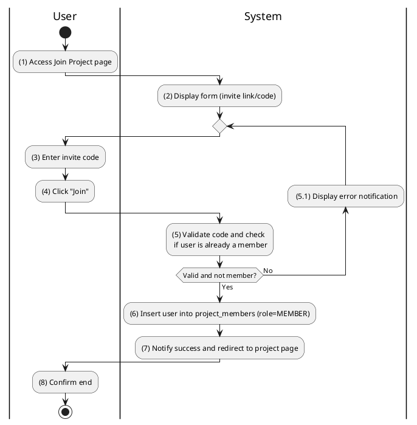

# Activity Join Project

```plantuml
@startuml
|U|User
|S|System

|U|
start
:(1) Access Join Project page;

|S|
:(2) Display form (invite link/code);

repeat
  |U|
  :(3) Enter invite code;
  :(4) Click "Join";

  |S|
  :(5) Validate code and check \n if user is already a member;
  backward: (5.1) Display error notification;
repeat while (Valid and not member?) is (No) not (Yes)

:(6) Insert user into project_members (role=MEMBER);
:(7) Notify success and redirect to project page;

|U|
:(8) Confirm end;

stop
@enduml
```

<!-- diagram id="activity-project-management-join-project" -->
