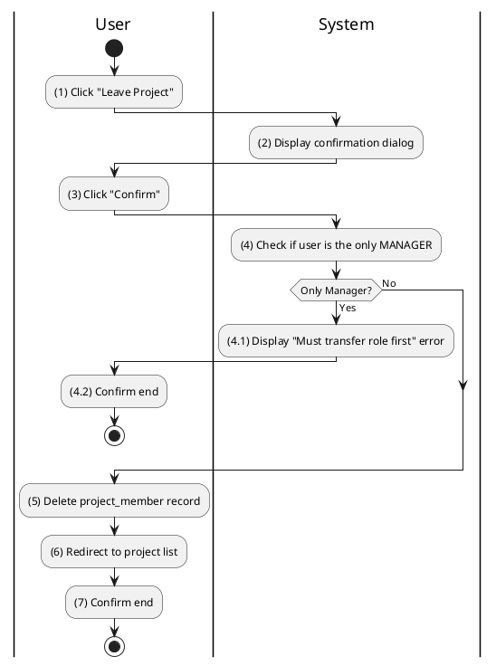

# Activity Leave Project

```plantuml
@startuml
|U|User
|S|System

|U|
start
:(1) Click "Leave Project";

|S|
:(2) Display confirmation dialog;

|U|
:(3) Click "Confirm";

|S|
:(4) Check if user is the only MANAGER;

if (Only Manager?) then (Yes)
  :(4.1) Display "Must transfer role first" error;
  |U|
  :(4.2) Confirm end;
  stop
else (No)
endif

:(5) Delete project_member record;
:(6) Redirect to project list;

|U|
:(7) Confirm end;

stop
@enduml
```

<!-- diagram id="activity-project-management-leave-project" -->
