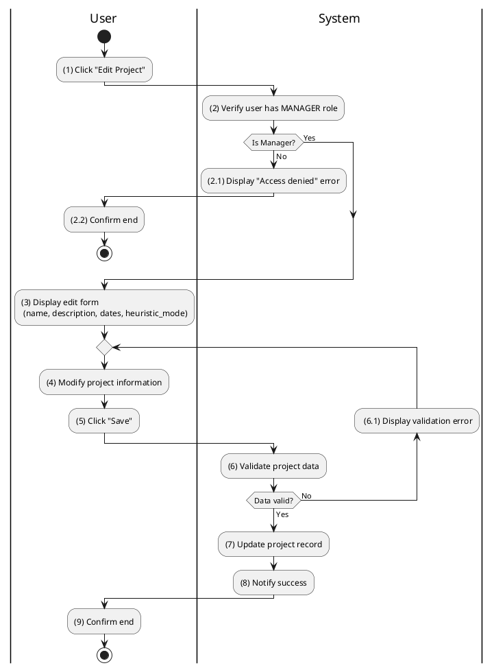

# Activity Update Project Information

```plantuml
@startuml
|U|User
|S|System

|U|
start
:(1) Click "Edit Project";

|S|
:(2) Verify user has MANAGER role;

if (Is Manager?) then (No)
  :(2.1) Display "Access denied" error;
  |U|
  :(2.2) Confirm end;
  stop
else (Yes)
endif

:(3) Display edit form \n (name, description, dates, heuristic_mode);

repeat
  |U|
  :(4) Modify project information;
  :(5) Click "Save";

  |S|
  :(6) Validate project data;
  backward: (6.1) Display validation error;
repeat while (Data valid?) is (No) not (Yes)

:(7) Update project record;
:(8) Notify success;

|U|
:(9) Confirm end;

stop
@enduml
```

<!-- diagram id="activity-project-management-update-project-information" -->
