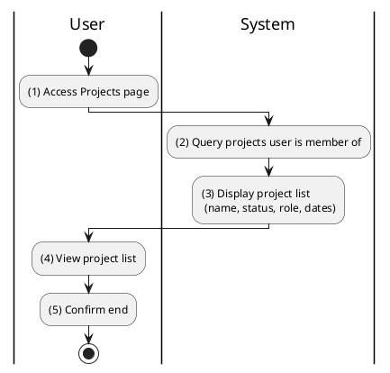

# Activity View Joined Projects

```plantuml
@startuml
|U|User
|S|System

|U|
start
:(1) Access Projects page;

|S|
:(2) Query projects user is member of;
:(3) Display project list \n (name, status, role, dates);

|U|
:(4) View project list;
:(5) Confirm end;

stop
@enduml
```

<!-- diagram id="activity-project-management-view-joined-projects" -->
