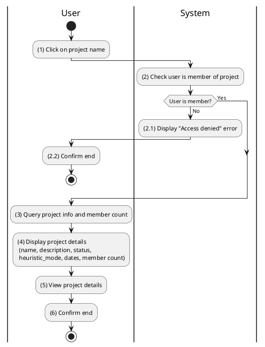

# Activity View Project Details

```plantuml
@startuml
|U|User
|S|System

|U|
start
:(1) Click on project name;

|S|
:(2) Check user is member of project;

if (User is member?) then (No)
  :(2.1) Display "Access denied" error;
  |U|
  :(2.2) Confirm end;
  stop
else (Yes)
endif

:(3) Query project info and member count;
:(4) Display project details \n (name, description, status, \n heuristic_mode, dates, member count);

|U|
:(5) View project details;
:(6) Confirm end;

stop
@enduml
```

<!-- diagram id="activity-project-management-view-project-details" -->
