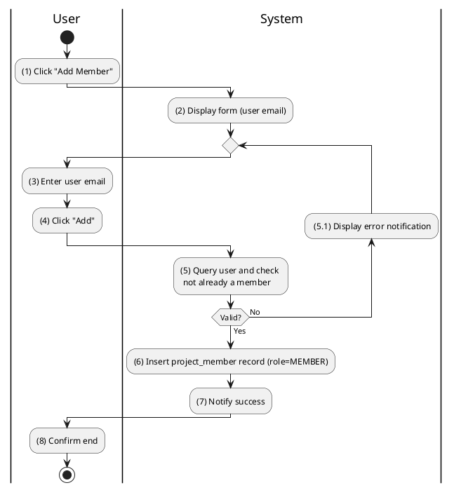

# Activity Add Member to Project

```plantuml
@startuml
|U|User
|S|System

|U|
start
:(1) Click "Add Member";

|S|
:(2) Display form (user email);

repeat
  |U|
  :(3) Enter user email;
  :(4) Click "Add";

  |S|
  :(5) Query user and check \n not already a member;
  backward: (5.1) Display error notification;
repeat while (Valid?) is (No) not (Yes)

:(6) Insert project_member record (role=MEMBER);
:(7) Notify success;

|U|
:(8) Confirm end;

stop
@enduml
```

<!-- diagram id="activity-project-members-add-member-to-project" -->
