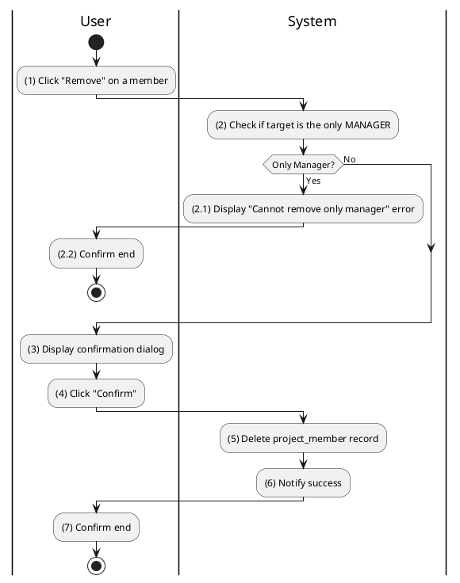

# Activity Remove Member from Project

```plantuml
@startuml
|U|User
|S|System

|U|
start
:(1) Click "Remove" on a member;

|S|
:(2) Check if target is the only MANAGER;

if (Only Manager?) then (Yes)
  :(2.1) Display "Cannot remove only manager" error;
  |U|
  :(2.2) Confirm end;
  stop
else (No)
endif

:(3) Display confirmation dialog;

|U|
:(4) Click "Confirm";

|S|
:(5) Delete project_member record;
:(6) Notify success;

|U|
:(7) Confirm end;

stop
@enduml
```

<!-- diagram id="activity-project-members-remove-member-from-project" -->
