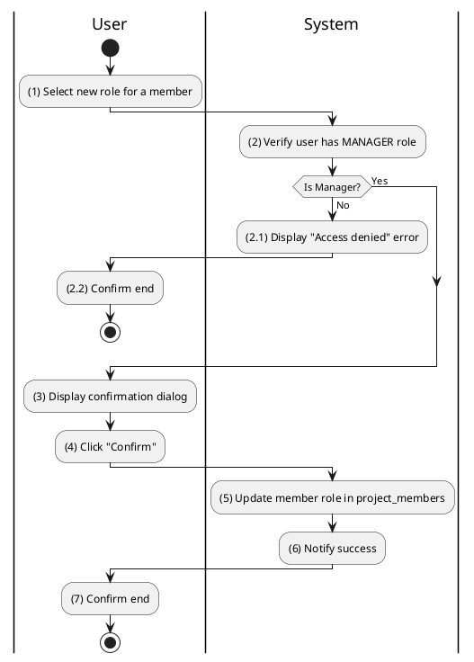

# Activity Update Member Role

```plantuml
@startuml
|U|User
|S|System

|U|
start
:(1) Select new role for a member;

|S|
:(2) Verify user has MANAGER role;

if (Is Manager?) then (No)
  :(2.1) Display "Access denied" error;
  |U|
  :(2.2) Confirm end;
  stop
else (Yes)
endif

:(3) Display confirmation dialog;

|U|
:(4) Click "Confirm";

|S|
:(5) Update member role in project_members;
:(6) Notify success;

|U|
:(7) Confirm end;

stop
@enduml
```

<!-- diagram id="activity-project-members-update-member-role" -->
