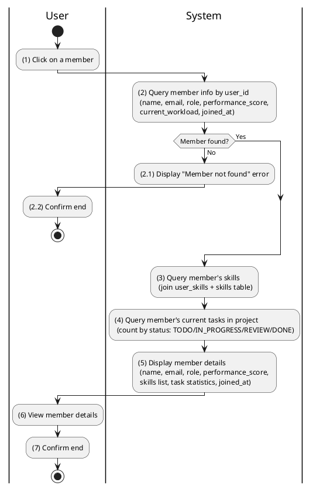

# Activity View Member Details

```plantuml
@startuml
|U|User
|S|System

|U|
start
:(1) Click on a member;

|S|
:(2) Query member info by user_id \n (name, email, role, performance_score, \n current_workload, joined_at);

if (Member found?) then (No)
  :(2.1) Display "Member not found" error;
  |U|
  :(2.2) Confirm end;
  stop
else (Yes)
endif

|S|
:(3) Query member's skills \n (join user_skills + skills table);
:(4) Query member's current tasks in project \n (count by status: TODO/IN_PROGRESS/REVIEW/DONE);
:(5) Display member details \n (name, email, role, performance_score, \n skills list, task statistics, joined_at);

|U|
:(6) View member details;
:(7) Confirm end;

stop
@enduml
```

<!-- diagram id="activity-project-members-view-member-details" -->
