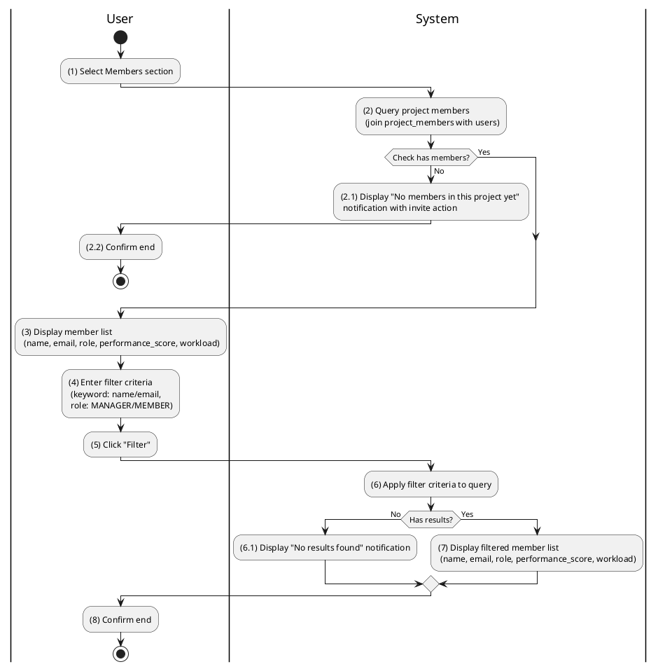

# Activity View Project Member List

```plantuml
@startuml
|U|User
|S|System

|U|
start
:(1) Select Members section;

|S|
:(2) Query project members \n (join project_members with users);

if (Check has members?) then (No)
  :(2.1) Display "No members in this project yet" \n notification with invite action;
  |U|
  :(2.2) Confirm end;
  stop
else (Yes)
endif

:(3) Display member list \n (name, email, role, performance_score, workload);

|U|
:(4) Enter filter criteria \n (keyword: name/email, \n role: MANAGER/MEMBER);
:(5) Click "Filter";

|S|
:(6) Apply filter criteria to query;

if (Has results?) then (No)
  :(6.1) Display "No results found" notification;
  |U|
else (Yes)
  |S|
  :(7) Display filtered member list \n (name, email, role, performance_score, workload);
  |U|
endif

:(8) Confirm end;

stop
@enduml
```

<!-- diagram id="activity-project-members-view-project-member-list" -->
