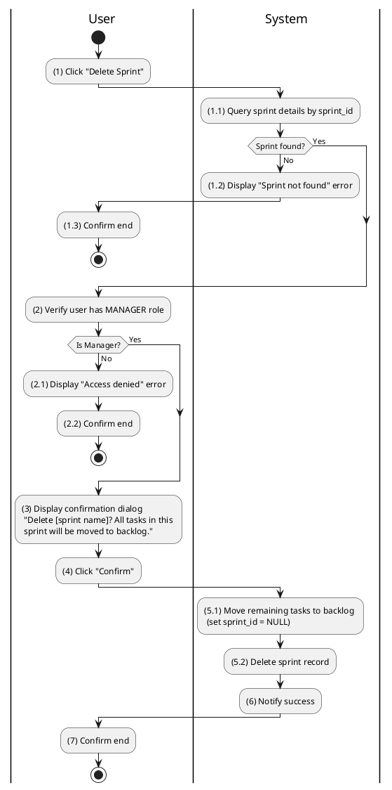

# Activity Delete Sprint

```plantuml
@startuml
|U|User
|S|System

|U|
start
:(1) Click "Delete Sprint";

|S|
:(1.1) Query sprint details by sprint_id;

if (Sprint found?) then (No)
  :(1.2) Display "Sprint not found" error;
  |U|
  :(1.3) Confirm end;
  stop
else (Yes)
endif

:(2) Verify user has MANAGER role;

if (Is Manager?) then (No)
  :(2.1) Display "Access denied" error;
  |U|
  :(2.2) Confirm end;
  stop
else (Yes)
endif

:(3) Display confirmation dialog \n "Delete [sprint name]? All tasks in this \n sprint will be moved to backlog.";

|U|
:(4) Click "Confirm";

|S|
:(5.1) Move remaining tasks to backlog \n (set sprint_id = NULL);
:(5.2) Delete sprint record;
:(6) Notify success;

|U|
:(7) Confirm end;

stop
@enduml
```

<!-- diagram id="activity-sprint-management-delete-sprint" -->
