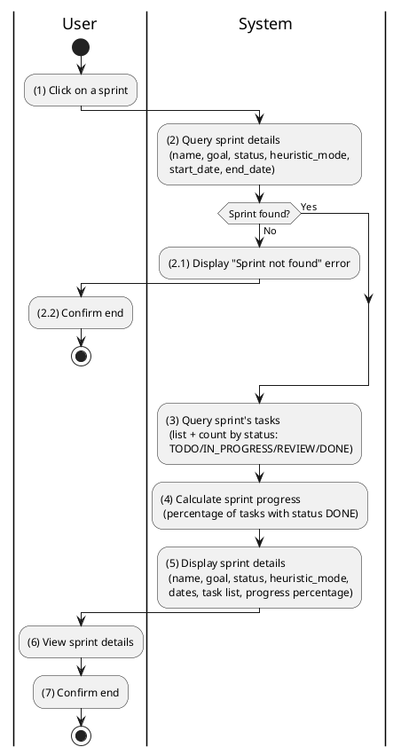

# Activity View Sprint Details

```plantuml
@startuml
|U|User
|S|System

|U|
start
:(1) Click on a sprint;

|S|
:(2) Query sprint details \n (name, goal, status, heuristic_mode, \n start_date, end_date);

if (Sprint found?) then (No)
  :(2.1) Display "Sprint not found" error;
  |U|
  :(2.2) Confirm end;
  stop
else (Yes)
endif

|S|
:(3) Query sprint's tasks \n (list + count by status: \n TODO/IN_PROGRESS/REVIEW/DONE);
:(4) Calculate sprint progress \n (percentage of tasks with status DONE);
:(5) Display sprint details \n (name, goal, status, heuristic_mode, \n dates, task list, progress percentage);

|U|
:(6) View sprint details;
:(7) Confirm end;

stop
@enduml
```

<!-- diagram id="activity-sprint-management-view-sprint-details" -->
