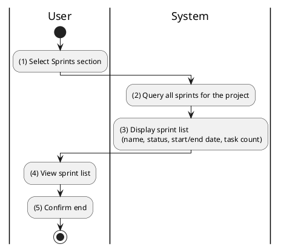

# Activity View Sprint List

```plantuml
@startuml
|U|User
|S|System

|U|
start
:(1) Select Sprints section;

|S|
:(2) Query all sprints for the project;
:(3) Display sprint list \n (name, status, start/end date, task count);

|U|
:(4) View sprint list;
:(5) Confirm end;

stop
@enduml
```

<!-- diagram id="activity-sprint-management-view-sprint-list" -->
