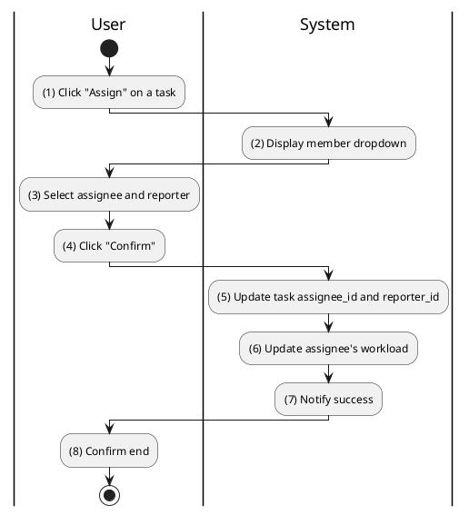

# Activity Assign Assignee & Reporter

```plantuml
@startuml
|U|User
|S|System

|U|
start
:(1) Click "Assign" on a task;

|S|
:(2) Display member dropdown;

|U|
:(3) Select assignee and reporter;
:(4) Click "Confirm";

|S|
:(5) Update task assignee_id and reporter_id;
:(6) Update assignee's workload;
:(7) Notify success;

|U|
:(8) Confirm end;

stop
@enduml
```

<!-- diagram id="activity-task-management-assign-assignee-reporter" -->
