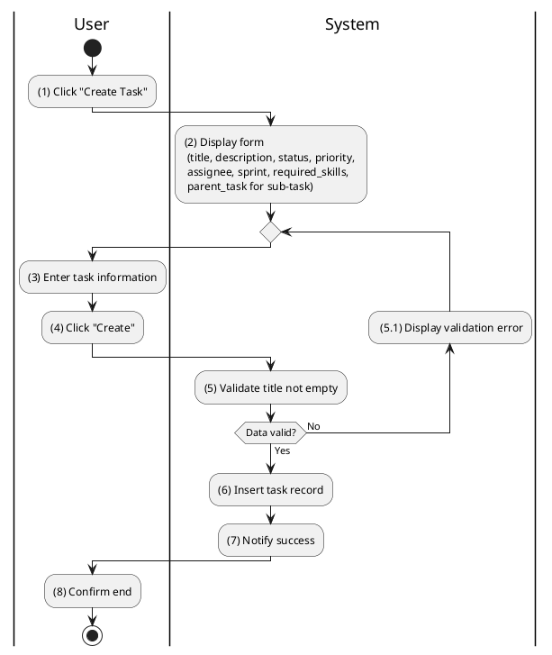

# Activity Create New Task / Sub-task

```plantuml
@startuml
|U|User
|S|System

|U|
start
:(1) Click "Create Task";

|S|
:(2) Display form \n (title, description, status, priority, \n assignee, sprint, required_skills, \n parent_task for sub-task);

repeat
  |U|
  :(3) Enter task information;
  :(4) Click "Create";

  |S|
  :(5) Validate title not empty;
  backward: (5.1) Display validation error;
repeat while (Data valid?) is (No) not (Yes)

:(6) Insert task record;
:(7) Notify success;

|U|
:(8) Confirm end;

stop
@enduml
```

<!-- diagram id="activity-task-management-create-new-task" -->
