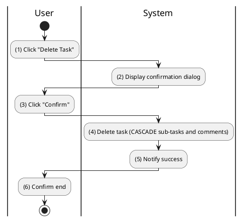

# Activity Delete Task

```plantuml
@startuml
|U|User
|S|System

|U|
start
:(1) Click "Delete Task";

|S|
:(2) Display confirmation dialog;

|U|
:(3) Click "Confirm";

|S|
:(4) Delete task (CASCADE sub-tasks and comments);
:(5) Notify success;

|U|
:(6) Confirm end;

stop
@enduml
```

<!-- diagram id="activity-task-management-delete-task" -->
