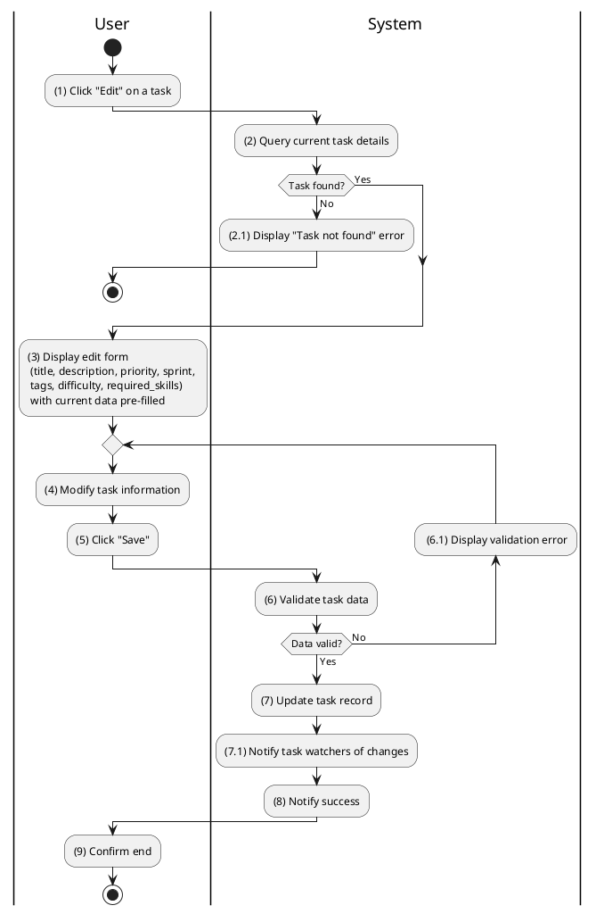

# Activity Update Task Information

```plantuml
@startuml
|U|User
|S|System

|U|
start
:(1) Click "Edit" on a task;

|S|
:(2) Query current task details;

if (Task found?) then (No)
  :(2.1) Display "Task not found" error;
  |U|
  stop
else (Yes)
endif

:(3) Display edit form \n (title, description, priority, sprint, \n tags, difficulty, required_skills) \n with current data pre-filled;

repeat
  |U|
  :(4) Modify task information;
  :(5) Click "Save";

  |S|
  :(6) Validate task data;
  backward: (6.1) Display validation error;
repeat while (Data valid?) is (No) not (Yes)

:(7) Update task record;
:(7.1) Notify task watchers of changes;
:(8) Notify success;

|U|
:(9) Confirm end;

stop
@enduml
```

<!-- diagram id="activity-task-management-update-task-information" -->
