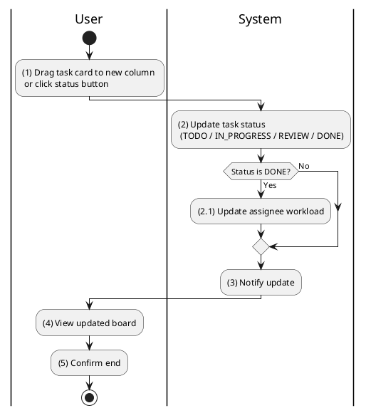

# Activity Update Task Status

```plantuml
@startuml
|U|User
|S|System

|U|
start
:(1) Drag task card to new column \n or click status button;

|S|
:(2) Update task status \n (TODO / IN_PROGRESS / REVIEW / DONE);

if (Status is DONE?) then (Yes)
  :(2.1) Update assignee workload;
else (No)
endif

:(3) Notify update;

|U|
:(4) View updated board;
:(5) Confirm end;

stop
@enduml
```

<!-- diagram id="activity-task-management-update-task-status" -->
