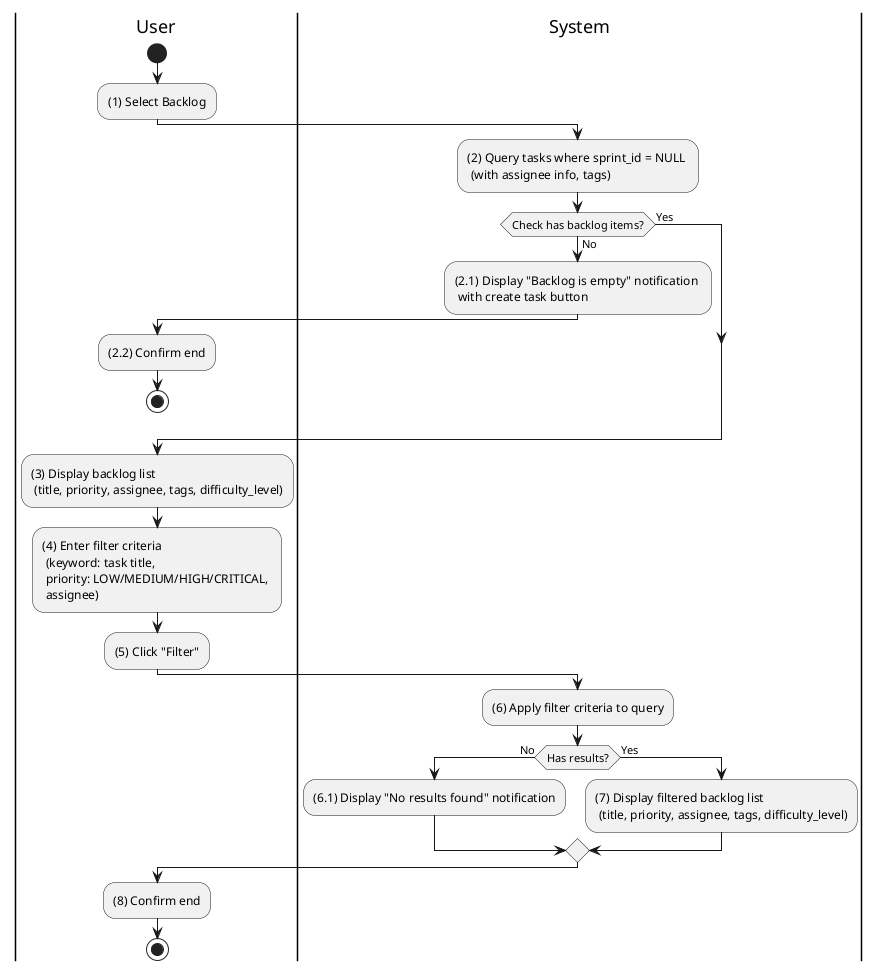

# Activity View Backlog

```plantuml
@startuml
|U|User
|S|System

|U|
start
:(1) Select Backlog;

|S|
:(2) Query tasks where sprint_id = NULL \n (with assignee info, tags);

if (Check has backlog items?) then (No)
  :(2.1) Display "Backlog is empty" notification \n with create task button;
  |U|
  :(2.2) Confirm end;
  stop
else (Yes)
endif

:(3) Display backlog list \n (title, priority, assignee, tags, difficulty_level);

|U|
:(4) Enter filter criteria \n (keyword: task title, \n priority: LOW/MEDIUM/HIGH/CRITICAL, \n assignee);
:(5) Click "Filter";

|S|
:(6) Apply filter criteria to query;

if (Has results?) then (No)
  :(6.1) Display "No results found" notification;
  |U|
else (Yes)
  |S|
  :(7) Display filtered backlog list \n (title, priority, assignee, tags, difficulty_level);
  |U|
endif

:(8) Confirm end;

stop
@enduml
```

<!-- diagram id="activity-task-management-view-backlog" -->
