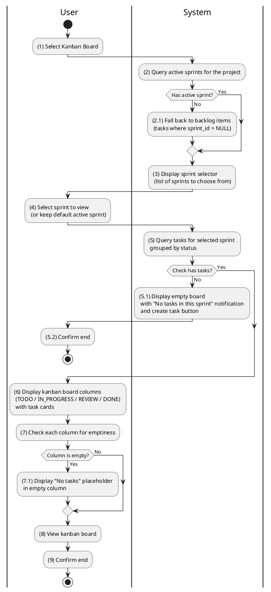

# Activity View Kanban Board

```plantuml
@startuml
|U|User
|S|System

|U|
start
:(1) Select Kanban Board;

|S|
:(2) Query active sprints for the project;

if (Has active sprint?) then (No)
  :(2.1) Fall back to backlog items \n (tasks where sprint_id = NULL);
else (Yes)
endif

:(3) Display sprint selector \n (list of sprints to choose from);

|U|
:(4) Select sprint to view \n (or keep default active sprint);

|S|
:(5) Query tasks for selected sprint \n grouped by status;

if (Check has tasks?) then (No)
  :(5.1) Display empty board \n with "No tasks in this sprint" notification \n and create task button;
  |U|
  :(5.2) Confirm end;
  stop
else (Yes)
endif

:(6) Display kanban board columns \n (TODO / IN_PROGRESS / REVIEW / DONE) \n with task cards;

:(7) Check each column for emptiness;

if (Column is empty?) then (Yes)
  :(7.1) Display "No tasks" placeholder \n in empty column;
  |U|
else (No)
  |U|
endif

:(8) View kanban board;
:(9) Confirm end;

stop
@enduml
```

<!-- diagram id="activity-task-management-view-kanban-board" -->
