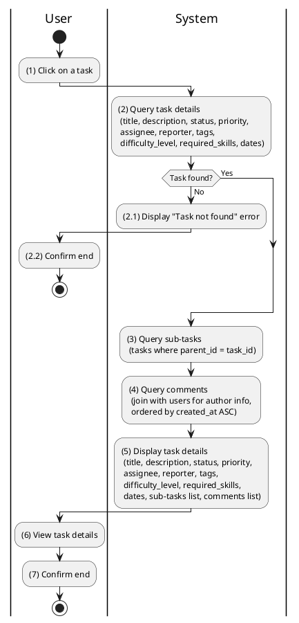

# Activity View Task Details

```plantuml
@startuml
|U|User
|S|System

|U|
start
:(1) Click on a task;

|S|
:(2) Query task details \n (title, description, status, priority, \n assignee, reporter, tags, \n difficulty_level, required_skills, dates);

if (Task found?) then (No)
  :(2.1) Display "Task not found" error;
  |U|
  :(2.2) Confirm end;
  stop
else (Yes)
endif

|S|
:(3) Query sub-tasks \n (tasks where parent_id = task_id);
:(4) Query comments \n (join with users for author info, \n ordered by created_at ASC);
:(5) Display task details \n (title, description, status, priority, \n assignee, reporter, tags, \n difficulty_level, required_skills, \n dates, sub-tasks list, comments list);

|U|
:(6) View task details;
:(7) Confirm end;

stop
@enduml
```

<!-- diagram id="activity-task-management-view-task-details" -->
